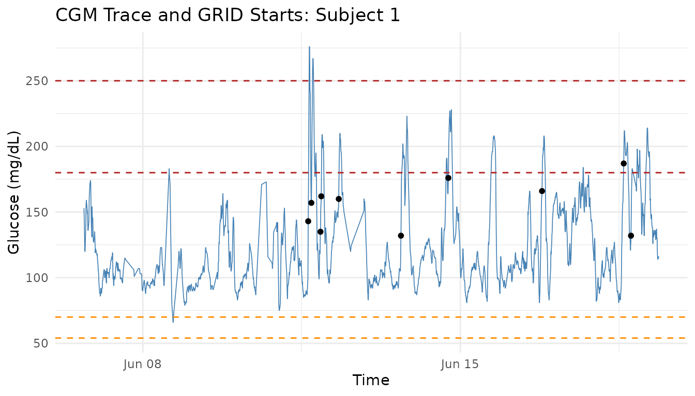

# cgmguru: Practical CGM Analysis Guide

## Overview

`cgmguru` provides high-performance tools for continuous glucose
monitoring (CGM) analysis. It combines two complementary workflows:

- consensus-style glycemic event detection for hypo- and hyperglycemia
- GRID-based detection of rapid glucose rises and postprandial maxima

This guide expands the package-level vignette into a practical workflow.
It is based on the longer
[`vignette("intro", package = "cgmguru")`](https://shstat1729.github.io/cgmguru/articles/intro.md)
source and focuses on how to move from a raw CGM table to subject
summaries, event tables, GRID starts, postprandial peaks, and simple
visual checks.

## Data Contract

Most `cgmguru` functions expect a data frame with these columns:

| Column | Meaning                |
|--------|------------------------|
| `id`   | Subject identifier     |
| `time` | POSIXct timestamp      |
| `gl`   | Glucose value in mg/dL |

Rows may contain multiple subjects. For speed and reproducibility, it is
good practice to order by `id` and `time` before analysis, especially
when chaining several functions.

``` r

data(example_data_5_subject, package = "iglu")
data(example_data_hall, package = "iglu")

cgm_data <- orderfast(example_data_5_subject)

data.frame(
  rows = nrow(cgm_data),
  subjects = length(unique(cgm_data$id)),
  first_time = min(cgm_data$time),
  last_time = max(cgm_data$time),
  min_glucose = min(cgm_data$gl, na.rm = TRUE),
  max_glucose = max(cgm_data$gl, na.rm = TRUE)
)
#>    rows subjects          first_time           last_time min_glucose
#> 1 13866        5 2015-02-24 17:31:29 2015-06-19 08:59:36          50
#>   max_glucose
#> 1         400
```

``` r

cat("The 'iglu' package is not available, so example-data chunks are skipped.\n")
```

## Two Preprocessing Models

The package intentionally separates event-grid analysis from GRID-family
analysis.

Glycemic event functions use an iglu-compatible event grid:

- [`detect_hypoglycemic_events()`](https://shstat1729.github.io/cgmguru/reference/detect_hypoglycemic_events.md)
- [`detect_hyperglycemic_events()`](https://shstat1729.github.io/cgmguru/reference/detect_hyperglycemic_events.md)
- [`detect_all_events()`](https://shstat1729.github.io/cgmguru/reference/detect_all_events.md)
- [`interpolate_cgm()`](https://shstat1729.github.io/cgmguru/reference/interpolate_cgm.md)

These functions can infer `reading_minutes` per subject from the median
positive timestamp spacing. They align to a full-day grid, interpolate
gaps up to `inter_gap`, remove larger gap-masked rows, and classify
events by contiguous segments.

GRID-family functions operate on the rows you pass in:

- [`grid()`](https://shstat1729.github.io/cgmguru/reference/grid.md)
- [`mod_grid()`](https://shstat1729.github.io/cgmguru/reference/mod_grid.md)
- [`maxima_grid()`](https://shstat1729.github.io/cgmguru/reference/maxima_grid.md)
- [`find_local_maxima()`](https://shstat1729.github.io/cgmguru/reference/find_local_maxima.md)
- [`excursion()`](https://shstat1729.github.io/cgmguru/reference/excursion.md)

They do not automatically call the event-grid interpolation pipeline. If
you want GRID analysis on an interpolated series, explicitly pass the
interpolated data.

## Subject-Level Overview

[`sensor_wear()`](https://shstat1729.github.io/cgmguru/reference/sensor_wear.md)
calculates how much observed CGM data are present. By default it uses
each subject’s original timestamp span. Supplying `ndays` switches to a
fixed retrospective window ending at each subject’s last valid
timestamp, or at a common `end_date` if you provide one.

``` r

sensor_wear(cgm_data, reading_minutes = 5)
#> # A tibble: 5 × 6
#>   id        sensor_wear_percent sensor_wear ndays start_date         
#>   <chr>                   <dbl>       <dbl> <dbl> <dttm>             
#> 1 Subject 1                79.8        79.8    NA 2015-06-06 16:50:27
#> 2 Subject 2                58.9        58.9    NA 2015-02-24 17:31:29
#> 3 Subject 3                92.1        92.1    NA 2015-03-10 15:36:26
#> 4 Subject 4                98.7        98.7    NA 2015-03-13 12:44:09
#> 5 Subject 5                95.8        95.8    NA 2015-02-28 17:40:06
#> # ℹ 1 more variable: end_date <dttm>

sensor_wear(cgm_data, ndays = 14, reading_minutes = 5)
#> # A tibble: 5 × 6
#>   id        sensor_wear_percent sensor_wear ndays start_date         
#>   <chr>                   <dbl>       <dbl> <dbl> <dttm>             
#> 1 Subject 1                72.3        72.3    14 2015-06-05 08:59:36
#> 2 Subject 2                51.1        51.1    14 2015-02-27 09:38:01
#> 3 Subject 3                38.0        38.0    14 2015-03-02 10:11:05
#> 4 Subject 4                90.9        90.9    14 2015-03-12 10:01:58
#> 5 Subject 5                72.5        72.5    14 2015-02-25 08:04:28
#> # ℹ 1 more variable: end_date <dttm>
```

For a broader one-row-per-subject summary, use
[`detect_all_events()`](https://shstat1729.github.io/cgmguru/reference/detect_all_events.md).

``` r

all_events <- detect_all_events(
  cgm_data,
  reading_minutes = 5,
  sensor_wear_ndays = 14
)

names(all_events)
#> [1] "subject_summary"        "glycemic_event_summary"
head(all_events$subject_summary)
#> # A tibble: 5 × 24
#>   id          TIR  TITR TBR70 TBR54 TAR180 TAR250    CV    SD mean_glucose   GMI
#>   <chr>     <dbl> <dbl> <dbl> <dbl>  <dbl>  <dbl> <dbl> <dbl>        <dbl> <dbl>
#> 1 Subject 1  91.7 73.7   0.14  0      8.2    0.38  26.9  33.3         124.  6.27
#> 2 Subject 2  26.4  3.36  0     0     73.6   26.1   24.0  52.4         218.  8.54
#> 3 Subject 3  81.3 49.8   0.33  0     18.3    5.68  29.1  44.8         154.  6.99
#> 4 Subject 4  95.1 67.7   0.27  0.05   4.61   0     22.4  29.1         130.  6.41
#> 5 Subject 5  62.1 30.1   0.1   0     37.8   11.3   33.6  58.6         175.  7.49
#> # ℹ 13 more variables: uGMI <dbl>, GRI <dbl>, sensor_wear_percent <dbl>,
#> #   hypo_lv1_total_episodes <int>, hypo_lv2_total_episodes <int>,
#> #   hypo_extended_total_episodes <int>, hypo_lv1_excl_total_episodes <int>,
#> #   hypo_rebound_total_episodes <int>, hyper_lv1_total_episodes <int>,
#> #   hyper_lv2_total_episodes <int>, hyper_extended_total_episodes <int>,
#> #   hyper_lv1_excl_total_episodes <int>, hyper_rebound_total_episodes <int>
head(all_events$glycemic_event_summary)
#> # A tibble: 6 × 6
#>   id        type  level    total_episodes avg_ep_per_day avg_minutes_below_54_…¹
#>   <chr>     <chr> <chr>             <int>          <dbl>                   <dbl>
#> 1 Subject 1 hypo  lv1                   1           0.09                       0
#> 2 Subject 1 hypo  lv2                   0           0                          0
#> 3 Subject 1 hypo  extended              0           0                          0
#> 4 Subject 1 hypo  lv1_excl              1           0.09                       0
#> 5 Subject 1 hypo  rebound               0           0                          0
#> 6 Subject 1 hyper lv1                  16           1.44                       0
#> # ℹ abbreviated name: ¹​avg_minutes_below_54_per_episode
```

The `subject_summary` table includes CGM summary metrics such as time in
range, time below range, time above range, mean glucose, variability,
GMI/uGMI, GRI, and `sensor_wear_percent`. By default, these summary
glucose metrics are calculated from the original raw glucose values. Set
`summary_metrics_source = "preprocessed"` to calculate them from the
internal event grid after interpolation and gap masking.

``` r

all_events_preprocessed <- detect_all_events(
  cgm_data,
  reading_minutes = 5,
  summary_metrics_source = "preprocessed"
)

head(all_events_preprocessed$subject_summary)
#> # A tibble: 5 × 24
#>   id          TIR  TITR TBR70 TBR54 TAR180 TAR250    CV    SD mean_glucose   GMI
#>   <chr>     <dbl> <dbl> <dbl> <dbl>  <dbl>  <dbl> <dbl> <dbl>        <dbl> <dbl>
#> 1 Subject 1  91.8 74.0   0.16  0      8.08   0.37  26.7  33.0         123.  6.26
#> 2 Subject 2  25.8  3.28  0     0     74.2   26.5   24.1  52.6         219.  8.54
#> 3 Subject 3  81.3 49.8   0.32  0     18.4    5.44  29.0  44.5         154.  6.98
#> 4 Subject 4  94.9 67.4   0.33  0.03   4.75   0     22.4  29.0         130.  6.41
#> 5 Subject 5  62.0 29.6   0.1   0     37.9   11.5   33.4  58.4         175.  7.49
#> # ℹ 13 more variables: uGMI <dbl>, GRI <dbl>, sensor_wear_percent <dbl>,
#> #   hypo_lv1_total_episodes <int>, hypo_lv2_total_episodes <int>,
#> #   hypo_extended_total_episodes <int>, hypo_lv1_excl_total_episodes <int>,
#> #   hypo_rebound_total_episodes <int>, hyper_lv1_total_episodes <int>,
#> #   hyper_lv2_total_episodes <int>, hyper_extended_total_episodes <int>,
#> #   hyper_lv1_excl_total_episodes <int>, hyper_rebound_total_episodes <int>
```

## Inspecting the Event Grid

When you need to audit event boundaries, use
`return_interpolated = TRUE`. The returned `interpolated_data` is the
grid used internally for event classification.

``` r

all_events_with_grid <- detect_all_events(
  cgm_data,
  reading_minutes = 5,
  return_interpolated = TRUE
)

names(all_events_with_grid)
#> [1] "subject_summary"        "glycemic_event_summary" "interpolated_data"
head(all_events_with_grid$interpolated_data)
#> # A tibble: 6 × 3
#>   id        time                   gl
#>   <chr>     <dttm>              <dbl>
#> 1 Subject 1 2015-06-06 16:55:00  148.
#> 2 Subject 1 2015-06-06 17:00:00  143.
#> 3 Subject 1 2015-06-06 17:05:00  137.
#> 4 Subject 1 2015-06-06 17:10:00  129.
#> 5 Subject 1 2015-06-06 17:15:00  122.
#> 6 Subject 1 2015-06-06 17:20:00  121.
```

The standalone helper
[`interpolate_cgm()`](https://shstat1729.github.io/cgmguru/reference/interpolate_cgm.md)
is useful when you want to inspect preprocessing before running event
detectors.

``` r

event_grid <- interpolate_cgm(cgm_data, reading_minutes = 5)
head(event_grid)
#> # A tibble: 6 × 3
#>   id        time                   gl
#>   <chr>     <dttm>              <dbl>
#> 1 Subject 1 2015-06-06 16:55:00  148.
#> 2 Subject 1 2015-06-06 17:00:00  143.
#> 3 Subject 1 2015-06-06 17:05:00  137.
#> 4 Subject 1 2015-06-06 17:10:00  129.
#> 5 Subject 1 2015-06-06 17:15:00  122.
#> 6 Subject 1 2015-06-06 17:20:00  121.
```

## Hypoglycemia and Hyperglycemia Events

Use the standalone event functions when you need detailed event
boundaries for one event type. Presets are available through
`type = "lv1"`, `"lv2"`, `"extended"`, and `"lv1_excl"`.

``` r

hyper_lv1 <- detect_hyperglycemic_events(
  cgm_data,
  type = "lv1",
  reading_minutes = 5,
  return_interpolated = FALSE
)

hypo_lv1 <- detect_hypoglycemic_events(
  cgm_data,
  type = "lv1",
  reading_minutes = 5,
  return_interpolated = FALSE
)

hyper_lv1$events_total
#> # A tibble: 5 × 3
#>   id        total_episodes avg_ep_per_day
#>   <chr>              <int>          <dbl>
#> 1 Subject 1             16           1.44
#> 2 Subject 2             21           2.13
#> 3 Subject 3              9           1.64
#> 4 Subject 4             13           1.02
#> 5 Subject 5             38           3.72
hypo_lv1$events_total
#> # A tibble: 5 × 3
#>   id        total_episodes avg_ep_per_day
#>   <chr>              <int>          <dbl>
#> 1 Subject 1              1           0.09
#> 2 Subject 2              0           0   
#> 3 Subject 3              1           0.18
#> 4 Subject 4              2           0.16
#> 5 Subject 5              1           0.1
head(hyper_lv1$events_detailed)
#> # A tibble: 6 × 7
#>   id        start_time          start_glucose end_time            end_glucose
#>   <chr>     <dttm>                      <dbl> <dttm>                    <dbl>
#> 1 Subject 1 2015-06-11 15:45:00          193. 2015-06-11 16:50:00        187.
#> 2 Subject 1 2015-06-11 17:25:00          195. 2015-06-11 19:00:00        183.
#> 3 Subject 1 2015-06-11 19:20:00          181. 2015-06-11 19:45:00        187.
#> 4 Subject 1 2015-06-11 22:35:00          187. 2015-06-11 23:45:00        185.
#> 5 Subject 1 2015-06-12 07:50:00          181. 2015-06-12 09:15:00        181.
#> 6 Subject 1 2015-06-13 16:55:00          180. 2015-06-13 18:25:00        186.
#> # ℹ 2 more variables: start_index <int>, end_index <int>
```

[`detect_all_events()`](https://shstat1729.github.io/cgmguru/reference/detect_all_events.md)
is usually the most convenient interface for reporting, because it
aggregates hypo- and hyperglycemia definitions in one call.

``` r

nonzero_events <- all_events$glycemic_event_summary[
  all_events$glycemic_event_summary$total_episodes > 0,
]
head(nonzero_events)
#> # A tibble: 6 × 6
#>   id        type  level    total_episodes avg_ep_per_day avg_minutes_below_54_…¹
#>   <chr>     <chr> <chr>             <int>          <dbl>                   <dbl>
#> 1 Subject 1 hypo  lv1                   1           0.09                       0
#> 2 Subject 1 hypo  lv1_excl              1           0.09                       0
#> 3 Subject 1 hyper lv1                  16           1.44                       0
#> 4 Subject 1 hyper lv2                   2           0.18                       0
#> 5 Subject 1 hyper lv1_excl             14           1.26                       0
#> 6 Subject 2 hyper lv1                  21           2.13                       0
#> # ℹ abbreviated name: ¹​avg_minutes_below_54_per_episode
```

## GRID Analysis

The GRID (Glucose Rate Increase Detector) workflow detects rapid glucose
rises, often used as candidate meal or postprandial start points.

``` r

grid_result <- grid(cgm_data, gap = 15, threshold = 130)

grid_result$episode_counts
#> # A tibble: 5 × 2
#>   id        episode_counts
#>   <chr>              <int>
#> 1 Subject 1             10
#> 2 Subject 2             22
#> 3 Subject 3              7
#> 4 Subject 4             18
#> 5 Subject 5             42
head(grid_result$episode_start)
#> # A tibble: 6 × 4
#>   id        time                   gl index
#>   <chr>     <dttm>              <dbl> <int>
#> 1 Subject 1 2015-06-11 15:30:07   143   966
#> 2 Subject 1 2015-06-11 17:10:07   157   985
#> 3 Subject 1 2015-06-11 22:00:06   135  1038
#> 4 Subject 1 2015-06-11 22:25:06   162  1043
#> 5 Subject 1 2015-06-12 07:40:04   160  1154
#> 6 Subject 1 2015-06-13 16:34:59   132  1415
head(grid_result$grid_vector)
#> # A tibble: 6 × 1
#>    grid
#>   <int>
#> 1     0
#> 2     0
#> 3     0
#> 4     0
#> 5     0
#> 6     0
```

Lowering the `threshold` or `gap` generally makes detection more
sensitive.

``` r

sensitive_grid <- grid(cgm_data, gap = 10, threshold = 120)
head(sensitive_grid$episode_counts)
#> # A tibble: 5 × 2
#>   id        episode_counts
#>   <chr>              <int>
#> 1 Subject 1             11
#> 2 Subject 2             22
#> 3 Subject 3             10
#> 4 Subject 4             22
#> 5 Subject 5             44
```

## Postprandial Maxima

[`maxima_grid()`](https://shstat1729.github.io/cgmguru/reference/maxima_grid.md)
combines GRID starts with local maxima to identify likely postprandial
peaks within a time window.

``` r

maxima_result <- maxima_grid(
  cgm_data,
  threshold = 130,
  gap = 60,
  hours = 2
)

maxima_result$episode_counts
#> # A tibble: 5 × 2
#>   id        episode_counts
#>   <chr>              <int>
#> 1 Subject 1              8
#> 2 Subject 2             18
#> 3 Subject 3              7
#> 4 Subject 4             16
#> 5 Subject 5             39
head(maxima_result$results)
#> # A tibble: 6 × 8
#>   id    grid_time grid_gl maxima_time maxima_glucose time_to_peak_min grid_index
#>   <chr> <dttm>      <dbl> <dttm>               <dbl>            <dbl>      <int>
#> 1 Subj… 2015-06-…     143 2015-06-11…            276               40        967
#> 2 Subj… 2015-06-…     135 2015-06-11…            209               50       1039
#> 3 Subj… 2015-06-…     160 2015-06-12…            210               40       1155
#> 4 Subj… 2015-06-…     132 2015-06-13…            202               60       1416
#> 5 Subj… 2015-06-…     176 2015-06-14…            227               45       1677
#> 6 Subj… 2015-06-…     166 2015-06-16…            208               65       2223
#> # ℹ 1 more variable: maxima_index <int>
```

For a more explicit step-by-step version of the workflow, chain the
lower-level helpers.

``` r

grid_starts <- start_finder(grid_result$grid_vector)

mod_grid_result <- mod_grid(
  cgm_data,
  grid_starts,
  hours = 2,
  gap = 60
)

mod_grid_starts <- start_finder(mod_grid_result$mod_grid_vector)

max_after_result <- find_max_after_hours(
  cgm_data,
  mod_grid_starts,
  hours = 2
)

local_maxima <- find_local_maxima(cgm_data)

new_maxima <- find_new_maxima(
  cgm_data,
  max_after_result$max_index,
  local_maxima$local_maxima_vector
)

mapped_maxima <- transform_df(grid_result$episode_start, new_maxima)
between_maxima <- detect_between_maxima(cgm_data, mapped_maxima)

head(mapped_maxima)
#> # A tibble: 6 × 5
#>   id        grid_time           grid_gl maxima_time         maxima_gl
#>   <chr>     <dttm>                <dbl> <dttm>                  <dbl>
#> 1 Subject 1 2015-06-11 20:30:07     143 2015-06-11 21:10:07       276
#> 2 Subject 1 2015-06-12 03:00:06     135 2015-06-12 03:50:06       209
#> 3 Subject 1 2015-06-12 03:25:06     162 2015-06-12 03:50:06       209
#> 4 Subject 1 2015-06-12 12:40:04     160 2015-06-12 13:20:04       210
#> 5 Subject 1 2015-06-13 21:34:59     132 2015-06-13 22:34:59       202
#> 6 Subject 1 2015-06-14 22:39:55     176 2015-06-14 23:24:55       227
head(between_maxima$results)
#> # A tibble: 6 × 6
#>   id        grid_time           grid_gl maxima_time  maxima_glucose time_to_peak
#>   <chr>     <dttm>                <dbl> <dttm>                <dbl>        <dbl>
#> 1 Subject 1 2015-06-11 15:30:07     143 2015-06-11 …            276         2400
#> 2 Subject 1 2015-06-11 22:00:06     135 2015-06-11 …            158         1200
#> 3 Subject 1 2015-06-11 22:25:06     162 2015-06-11 …            209         1500
#> 4 Subject 1 2015-06-12 07:40:04     160 2015-06-12 …            210         2400
#> 5 Subject 1 2015-06-13 16:34:59     132 2015-06-13 …            202         3600
#> 6 Subject 1 2015-06-14 17:39:55     176 2015-06-14 …            227         2700
```

## Excursion Analysis

[`excursion()`](https://shstat1729.github.io/cgmguru/reference/excursion.md)
identifies glucose excursions, defined as rises greater than 70 mg/dL
within 2 hours, excluding starts preceded by hypoglycemia.

``` r

excursion_result <- excursion(cgm_data, gap = 15)

excursion_result$episode_counts
#> # A tibble: 5 × 2
#>   id        episode_counts
#>   <chr>              <int>
#> 1 Subject 1              9
#> 2 Subject 2             14
#> 3 Subject 3             11
#> 4 Subject 4             17
#> 5 Subject 5             34
head(excursion_result$episode_start)
#> # A tibble: 6 × 8
#>   id        time            gl maxima_time maxima_glucose time_to_peak_min index
#>   <chr>     <dttm>       <dbl> <dttm>               <dbl>            <dbl> <int>
#> 1 Subject 1 2015-06-11 …    87 2015-06-11…            170              120   949
#> 2 Subject 1 2015-06-11 …   187 2015-06-11…            267               75   982
#> 3 Subject 1 2015-06-11 …   120 2015-06-11…            202              120  1027
#> 4 Subject 1 2015-06-13 …    95 2015-06-13…            172              120  1400
#> 5 Subject 1 2015-06-14 …   113 2015-06-14…            190              120  1650
#> 6 Subject 1 2015-06-15 …    85 2015-06-15…            158              120  1896
#> # ℹ 1 more variable: maxima_index <int>
```

## Quick Visualization

Visual checks are useful after tuning thresholds. The plot below shows
one subject’s glucose trace, clinical thresholds, and GRID episode
starts.

``` r

subject_id <- unique(cgm_data$id)[1]
subject_data <- cgm_data[cgm_data$id == subject_id, ]
subject_grid_starts <- grid_result$episode_start[
  grid_result$episode_start$id == subject_id,
]

ggplot2::ggplot(subject_data, ggplot2::aes(x = time, y = gl)) +
  ggplot2::geom_line(linewidth = 0.3, color = "steelblue") +
  ggplot2::geom_hline(yintercept = c(54, 70), linetype = "dashed",
                      color = "darkorange") +
  ggplot2::geom_hline(yintercept = c(180, 250), linetype = "dashed",
                      color = "firebrick") +
  ggplot2::geom_point(
    data = subject_grid_starts,
    ggplot2::aes(x = time, y = gl),
    color = "black",
    size = 1.4
  ) +
  ggplot2::labs(
    title = paste("CGM Trace and GRID Starts:", subject_id),
    x = "Time",
    y = "Glucose (mg/dL)"
  ) +
  ggplot2::theme_minimal()
```



``` r

cat("The 'ggplot2' package is not available, so the plot is skipped.\n")
```

## Scaling Up

The same workflow applies to larger multi-subject datasets. The example
below uses `example_data_hall` from `iglu`.

``` r

hall_data <- orderfast(example_data_hall)

hall_summary <- detect_all_events(hall_data, reading_minutes = 5)
hall_grid <- grid(hall_data, gap = 15, threshold = 130)

data.frame(
  subjects = length(unique(hall_data$id)),
  rows = nrow(hall_data),
  summary_rows = nrow(hall_summary$subject_summary),
  grid_rows = nrow(hall_grid$grid_vector)
)
#>   subjects  rows summary_rows grid_rows
#> 1       19 34890           19     34890
```

## Function Map

| Task | Main function |
|----|----|
| Order CGM rows | [`orderfast()`](https://shstat1729.github.io/cgmguru/reference/orderfast.md) |
| Calculate observed data coverage | [`sensor_wear()`](https://shstat1729.github.io/cgmguru/reference/sensor_wear.md) |
| Build an event preprocessing grid | [`interpolate_cgm()`](https://shstat1729.github.io/cgmguru/reference/interpolate_cgm.md) |
| Report all event summaries | [`detect_all_events()`](https://shstat1729.github.io/cgmguru/reference/detect_all_events.md) |
| Detect one hypo/hyper event type | [`detect_hypoglycemic_events()`](https://shstat1729.github.io/cgmguru/reference/detect_hypoglycemic_events.md), [`detect_hyperglycemic_events()`](https://shstat1729.github.io/cgmguru/reference/detect_hyperglycemic_events.md) |
| Detect rapid glucose rises | [`grid()`](https://shstat1729.github.io/cgmguru/reference/grid.md) |
| Detect local peaks | [`find_local_maxima()`](https://shstat1729.github.io/cgmguru/reference/find_local_maxima.md) |
| Combine GRID starts and peaks | [`maxima_grid()`](https://shstat1729.github.io/cgmguru/reference/maxima_grid.md) |
| Find peaks/minima around starts | [`find_max_after_hours()`](https://shstat1729.github.io/cgmguru/reference/find_max_after_hours.md), [`find_max_before_hours()`](https://shstat1729.github.io/cgmguru/reference/find_max_before_hours.md), [`find_min_after_hours()`](https://shstat1729.github.io/cgmguru/reference/find_min_after_hours.md), [`find_min_before_hours()`](https://shstat1729.github.io/cgmguru/reference/find_min_before_hours.md) |
| Refine and map postprandial peaks | [`find_new_maxima()`](https://shstat1729.github.io/cgmguru/reference/find_new_maxima.md), [`transform_df()`](https://shstat1729.github.io/cgmguru/reference/transform_df.md), [`detect_between_maxima()`](https://shstat1729.github.io/cgmguru/reference/detect_between_maxima.md) |
| Detect large glucose excursions | [`excursion()`](https://shstat1729.github.io/cgmguru/reference/excursion.md) |

## Next Steps

For more detailed examples, open the focused vignettes:

``` r

browseVignettes("cgmguru")
vignette("intro", package = "cgmguru")
vignette("detect_all_events", package = "cgmguru")
vignette("grid", package = "cgmguru")
vignette("maxima_grid", package = "cgmguru")
```

## References

- Harvey RA, Dassau E, Bevier WC, et al. Design of the glucose rate
  increase detector: a meal detection module for the health monitoring
  system. *Journal of Diabetes Science and Technology*.
  2014;8(2):307-320.
- Broll S, Urbanek J, Buchanan D, Chun E, Muschelli J, Punjabi N,
  Gaynanova I. Interpreting blood glucose data with R package iglu.
  *PLoS One*. 2021;16(4):e0248560.
- Chun E, Fernandes JN, Gaynanova I. An Update on the iglu Software
  Package for Interpreting Continuous Glucose Monitoring Data. *Diabetes
  Technology & Therapeutics*. 2024;26(12):939-950.
- Battelino T, Alexander CM, Amiel SA, et al. Continuous glucose
  monitoring and metrics for clinical trials: an international consensus
  statement. *The Lancet Diabetes & Endocrinology*. 2023;11(1):42-57.
