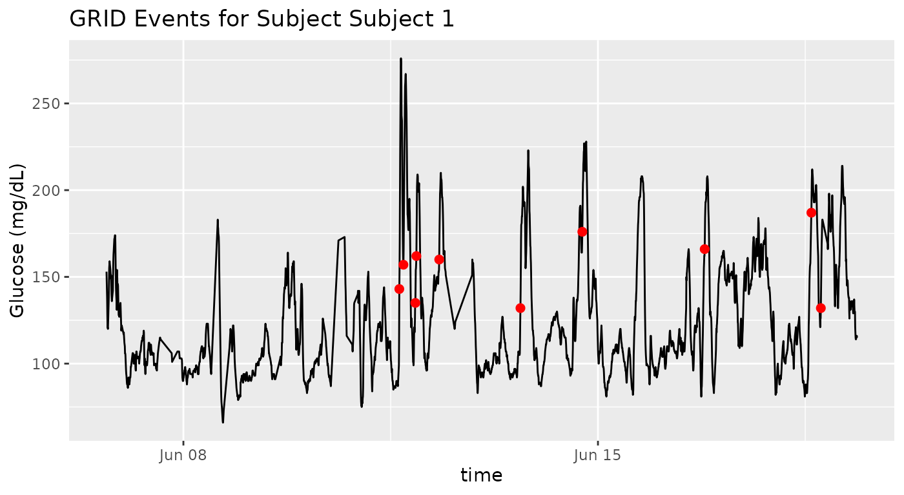

# grid function

## Introduction

The GRID (Glucose Rate Increase Detector) algorithm is designed to
automatically detect rapid increases in continuous glucose monitoring
(CGM) data. This is frequently used for meal detection and evaluating
time periods of significant glucose change.

This vignette demonstrates how to use the `grid` function from the
`cgmguru` package with real CGM data examples.

[`grid()`](https://shstat1729.github.io/cgmguru/reference/grid.md)
operates on the timestamps and glucose values supplied in `df`. It does
not automatically call
[`interpolate_cgm()`](https://shstat1729.github.io/cgmguru/reference/interpolate_cgm.md)
and does not use the full-day event preprocessing grid unless you
explicitly pass interpolated data to
[`grid()`](https://shstat1729.github.io/cgmguru/reference/grid.md).

## Example Data

The `iglu` package provides example multi-subject and single-subject
datasets that we use here.

``` r

data(example_data_5_subject)
data(example_data_hall)
```

## Basic GRID Analysis

We’ll run the GRID algorithm on a 5-subject CGM dataset, using default
parameter values (`gap = 15` minutes, `threshold = 130 mg/dL/h`).

``` r

grid_result <- grid(example_data_5_subject, gap = 15, threshold = 130)

# View the number of GRID events detected per subject
print(grid_result$episode_counts)
#> # A tibble: 5 × 2
#>   id        episode_counts
#>   <chr>              <int>
#> 1 Subject 1             10
#> 2 Subject 2             22
#> 3 Subject 3              7
#> 4 Subject 4             18
#> 5 Subject 5             42

# View the start points of GRID events
print(head(grid_result$episode_start))
#> # A tibble: 6 × 4
#>   id        time                   gl index
#>   <chr>     <dttm>              <dbl> <int>
#> 1 Subject 1 2015-06-11 15:30:07   143   966
#> 2 Subject 1 2015-06-11 17:10:07   157   985
#> 3 Subject 1 2015-06-11 22:00:06   135  1038
#> 4 Subject 1 2015-06-11 22:25:06   162  1043
#> 5 Subject 1 2015-06-12 07:40:04   160  1154
#> 6 Subject 1 2015-06-13 16:34:59   132  1415

# See the identified points in the time series
grid_points <- head(grid_result$grid_vector)
print(grid_points)
#> # A tibble: 6 × 1
#>    grid
#>   <int>
#> 1     0
#> 2     0
#> 3     0
#> 4     0
#> 5     0
#> 6     0
```

## Parameter Sensitivity

You can adjust the `gap` and `threshold` for more or less sensitive
detection. For example, lowering the threshold detects less pronounced
glucose rises.

``` r

sensitive_result <- grid(example_data_5_subject, gap = 10, threshold = 120)

print(head(sensitive_result$episode_counts))
#> # A tibble: 5 × 2
#>   id        episode_counts
#>   <chr>              <int>
#> 1 Subject 1             11
#> 2 Subject 2             22
#> 3 Subject 3             10
#> 4 Subject 4             22
#> 5 Subject 5             44
```

## Larger Dataset Example

Apply GRID analysis to a larger CGM dataset:

``` r

large_grid <- grid(example_data_hall, gap = 15, threshold = 130)
print(paste("Detected", sum(large_grid$episode_counts$episode_counts), "episodes"))
#> [1] "Detected 79 episodes"
```

## Plotting GRID Events Over Time

Here is how you might visualize GRID event starts against glucose time
series for one subject:

``` r

library(ggplot2)
subid <- example_data_5_subject$id[1]
subdata <- example_data_5_subject[example_data_5_subject$id == subid, ]
substarts <- grid_result$episode_start[grid_result$episode_start$id == subid, ]

plot <- ggplot(subdata, aes(x = time, y = gl)) +
  geom_line() +
  geom_point(data = substarts, aes(x = time, y = gl), color = 'red', size = 2) +
  labs(title = paste("GRID Events for Subject", subid), y = "Glucose (mg/dL)")
plot
```



## Conclusion

The GRID function automates the detection of rapid glycemic events in
CGM data, supporting clinical research and personalized diabetes care.

For further exploration, see function reference or try out other
algorithms and parameters in `cgmguru`.

## How to Open this Vignette in RStudio

You can open this vignette in the RStudio Help tab at any time with the
following command:

``` r

browseVignettes("cgmguru")
```

This command will list all vignettes for the `cgmguru` package; click on
“grid” to view this vignette in the Help panel.
