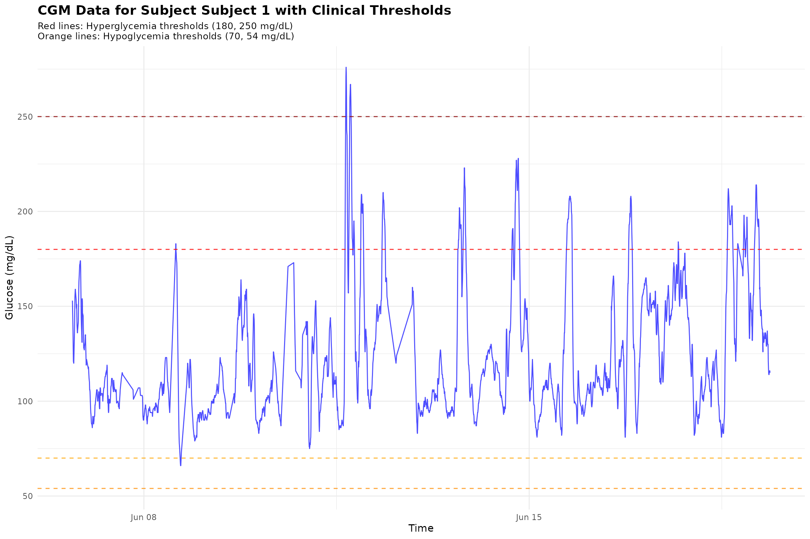
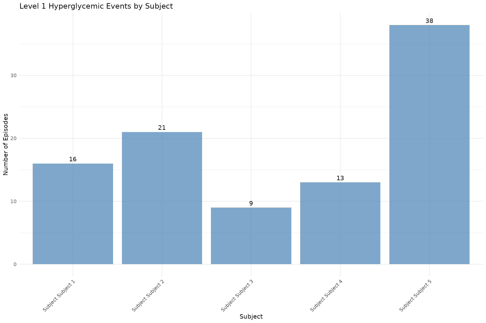

# cgmguru: Complete CGM Analysis Workflow

## cgmguru: Complete CGM Analysis Workflow

The `cgmguru` package provides comprehensive tools for analyzing
Continuous Glucose Monitoring (CGM) data using the GRID (Glucose Rate
Increase Detector) algorithm and related methodologies. This vignette
demonstrates the complete workflow from basic analysis to advanced event
detection.

For glycemic event calculation, cgmguru uses an independent C++/Rcpp
implementation of iglu-compatible preprocessing semantics: a
midnight-aligned full-day grid, interpolation up to `inter_gap`, removal
of larger gap-masked rows, and segment-wise event classification. This
preprocessing is specific to event functions and
[`interpolate_cgm()`](https://shstat1729.github.io/cgmguru/reference/interpolate_cgm.md).
GRID-family functions
([`grid()`](https://shstat1729.github.io/cgmguru/reference/grid.md),
[`maxima_grid()`](https://shstat1729.github.io/cgmguru/reference/maxima_grid.md),
and
[`excursion()`](https://shstat1729.github.io/cgmguru/reference/excursion.md))
operate on the input rows supplied by the user and do not automatically
use the full-day event grid.

If `reading_minutes` is omitted or `NULL`, event functions and
[`interpolate_cgm()`](https://shstat1729.github.io/cgmguru/reference/interpolate_cgm.md)
calculate it automatically per subject from the median positive
timestamp spacing in the data.

### Core functions at a glance

- **grid**: Implements GRID to detect rapid glucose rate increases (meal
  starts); returns grid vector and episode summaries.
- **mod_grid**: Re-applies GRID logic with a defined gap and window to
  produce a modified grid for maxima mapping.
- **maxima_grid**: Combines GRID and local maxima to identify
  postprandial peaks within a time window and summarizes episodes.
- **detect_hyperglycemic_events**: Finds Level 1/Level 2/Extended
  hyperglycemia episodes using consensus thresholds and durations.
- **detect_hypoglycemic_events**: Finds Level 1/Level 2/Extended
  hypoglycemia episodes and duration below 54 mg/dL where applicable.
- **detect_all_events**: Unified interface summarizing hypo/hyper event
  types, counts, and durations by subject.
- **find_local_maxima**: Detects peaks where glucose rises for two
  points before and falls for two points after the peak.
- **find_max_after_hours / find_max_before_hours**: Finds maximum
  glucose within a time window after/before given start points; returns
  index and episode counts.
- **find_min_after_hours / find_min_before_hours**: Finds minimum
  glucose within a time window after/before given start points.
- **find_new_maxima**: Refines maxima around candidate grid points to
  improve peak identification.
- **detect_between_maxima**: Characterizes events occurring between
  identified maxima, including time-to-peak.
- **excursion**: Calculates excursions (\>70 mg/dL rise within 2 hours,
  not preceded by \<70 mg/dL), with counts and starts.
- **start_finder**: Locates R-based positions of episode starts in a 0/1
  vector (1 after 0 or at start).
- **transform_df**: Maps GRID episode starts to maxima (within 4 hours)
  and merges results for downstream analysis.
- **orderfast**: Efficiently orders data by `id` and `time` for large
  CGM datasets.

Tip: See individual help pages for details and examples, for instance:

``` r

?grid
?detect_all_events
```

### Loading Sample Data

We’ll use two datasets from the `iglu` package to demonstrate different
analysis scenarios:

``` r

# Load example datasets
data(example_data_5_subject)  # 5 subjects, 13,866 readings
data(example_data_hall)       # 19 subjects, 34,890 readings

# Display basic information about the datasets
cat("Dataset 1 (example_data_5_subject):\n")
#> Dataset 1 (example_data_5_subject):
cat("  Rows:", nrow(example_data_5_subject), "\n")
#>   Rows: 13866
cat("  Subjects:", length(unique(example_data_5_subject$id)), "\n")
#>   Subjects: 5
cat("  Time range:", as.character(range(example_data_5_subject$time)), "\n")
#>   Time range: 2015-02-24 17:31:29 2015-06-19 08:59:36
cat("  Glucose range:", range(example_data_5_subject$gl), "mg/dL\n\n")
#>   Glucose range: 50 400 mg/dL

cat("Dataset 2 (example_data_hall):\n")
#> Dataset 2 (example_data_hall):
cat("  Rows:", nrow(example_data_hall), "\n")
#>   Rows: 34890
cat("  Subjects:", length(unique(example_data_hall$id)), "\n")
#>   Subjects: 19
cat("  Time range:", as.character(range(example_data_hall$time)), "\n")
#>   Time range: 2014-02-03 03:42:12 2017-06-14 13:57:42
cat("  Glucose range:", range(example_data_hall$gl), "mg/dL\n")
#>   Glucose range: 41 303 mg/dL

# Show first few rows
head(example_data_5_subject)
#>          id                time  gl
#> 1 Subject 1 2015-06-06 16:50:27 153
#> 2 Subject 1 2015-06-06 17:05:27 137
#> 3 Subject 1 2015-06-06 17:10:27 128
#> 4 Subject 1 2015-06-06 17:15:28 121
#> 5 Subject 1 2015-06-06 17:25:27 120
#> 6 Subject 1 2015-06-06 17:45:27 138
```

### 1. Basic GRID Analysis

The GRID algorithm detects rapid glucose rate increases, which are often
associated with meal consumption.

``` r

# Perform GRID analysis on the smaller dataset
grid_result <- grid(example_data_5_subject, gap = 15, threshold = 130)

# Display results
cat("GRID Analysis Results:\n")
#> GRID Analysis Results:
cat("  Detected grid points:", nrow(grid_result$grid_vector), "\n")
#>   Detected grid points: 13866
cat("  Episode counts:\n")
#>   Episode counts:
print(grid_result$episode_counts)
#> # A tibble: 5 × 2
#>   id        episode_counts
#>   <chr>              <int>
#> 1 Subject 1             10
#> 2 Subject 2             22
#> 3 Subject 3              7
#> 4 Subject 4             18
#> 5 Subject 5             42

# Show first few detected grid points
cat("\nFirst few detected grid points:\n")
#> 
#> First few detected grid points:
head(grid_result$grid_vector)
#> # A tibble: 6 × 1
#>    grid
#>   <int>
#> 1     0
#> 2     0
#> 3     0
#> 4     0
#> 5     0
#> 6     0
```

### 2. Hyperglycemic Event Detection

Detect different levels of hyperglycemic events according to clinical
guidelines.

``` r

# Level 1 Hyperglycemic events (≥15 consecutive minutes >180 mg/dL)
hyper_lv1 <- detect_hyperglycemic_events(
  example_data_5_subject, 
  type = "lv1"
)

# Level 2 Hyperglycemic events (≥15 consecutive minutes >250 mg/dL)
hyper_lv2 <- detect_hyperglycemic_events(
  example_data_5_subject, 
  type = "lv2"
)

# Extended Hyperglycemic events (default parameters)
hyper_extended <- detect_hyperglycemic_events(example_data_5_subject, type = "extended")

cat("Hyperglycemic Event Detection Results:\n")
#> Hyperglycemic Event Detection Results:
cat("Level 1 Events (>180 mg/dL):\n")
#> Level 1 Events (>180 mg/dL):
print(hyper_lv1$events_total)
#> # A tibble: 5 × 3
#>   id        total_episodes avg_ep_per_day
#>   <chr>              <int>          <dbl>
#> 1 Subject 1             16           1.44
#> 2 Subject 2             21           2.13
#> 3 Subject 3              9           1.64
#> 4 Subject 4             13           1.02
#> 5 Subject 5             38           3.72

cat("\nLevel 2 Events (>250 mg/dL):\n")
#> 
#> Level 2 Events (>250 mg/dL):
print(hyper_lv2$events_total)
#> # A tibble: 5 × 3
#>   id        total_episodes avg_ep_per_day
#>   <chr>              <int>          <dbl>
#> 1 Subject 1              2           0.18
#> 2 Subject 2             19           1.93
#> 3 Subject 3              4           0.73
#> 4 Subject 4              0           0   
#> 5 Subject 5             18           1.76

cat("\nExtended Events (default):\n")
#> 
#> Extended Events (default):
print(hyper_extended$events_total)
#> # A tibble: 5 × 3
#>   id        total_episodes avg_ep_per_day
#>   <chr>              <int>          <dbl>
#> 1 Subject 1              0           0   
#> 2 Subject 2             10           1.02
#> 3 Subject 3              2           0.36
#> 4 Subject 4              0           0   
#> 5 Subject 5             10           0.98

# Show detailed events for first subject
cat("\nDetailed Level 1 Events for Subject", hyper_lv1$events_detailed$id[1], ":\n")
#> 
#> Detailed Level 1 Events for Subject Subject 1 :
head(hyper_lv1$events_detailed[hyper_lv1$events_detailed$id == hyper_lv1$events_detailed$id[1], ])
#> # A tibble: 6 × 7
#>   id        start_time          start_glucose end_time            end_glucose
#>   <chr>     <dttm>                      <dbl> <dttm>                    <dbl>
#> 1 Subject 1 2015-06-11 15:45:00          193. 2015-06-11 16:50:00        187.
#> 2 Subject 1 2015-06-11 17:25:00          195. 2015-06-11 19:00:00        183.
#> 3 Subject 1 2015-06-11 19:20:00          181. 2015-06-11 19:45:00        187.
#> 4 Subject 1 2015-06-11 22:35:00          187. 2015-06-11 23:45:00        185.
#> 5 Subject 1 2015-06-12 07:50:00          181. 2015-06-12 09:15:00        181.
#> 6 Subject 1 2015-06-13 16:55:00          180. 2015-06-13 18:25:00        186.
#> # ℹ 2 more variables: start_index <int>, end_index <int>
```

### 3. Hypoglycemic Event Detection

Detect hypoglycemic events using different thresholds.

``` r

# Level 1 Hypoglycemic events (≤70 mg/dL)
hypo_lv1 <- detect_hypoglycemic_events(
  example_data_5_subject, 
  type = "lv1"
)

# Level 2 Hypoglycemic events (≤54 mg/dL)
hypo_lv2 <- detect_hypoglycemic_events(
  example_data_5_subject, 
  type = "lv2"
)

cat("Hypoglycemic Event Detection Results:\n")
#> Hypoglycemic Event Detection Results:
cat("Level 1 Events (≤70 mg/dL):\n")
#> Level 1 Events (≤70 mg/dL):
print(hypo_lv1$events_total)
#> # A tibble: 5 × 3
#>   id        total_episodes avg_ep_per_day
#>   <chr>              <int>          <dbl>
#> 1 Subject 1              1           0.09
#> 2 Subject 2              0           0   
#> 3 Subject 3              1           0.18
#> 4 Subject 4              2           0.16
#> 5 Subject 5              1           0.1

cat("\nLevel 2 Events (≤54 mg/dL):\n")
#> 
#> Level 2 Events (≤54 mg/dL):
print(hypo_lv2$events_total)
#> # A tibble: 5 × 3
#>   id        total_episodes avg_ep_per_day
#>   <chr>              <int>          <dbl>
#> 1 Subject 1              0              0
#> 2 Subject 2              0              0
#> 3 Subject 3              0              0
#> 4 Subject 4              0              0
#> 5 Subject 5              0              0
```

### 4. Comprehensive Event Detection

Detect all types of glycemic events in one analysis.

``` r

# Detect all events; reading_minutes is calculated automatically when omitted
all_events <- detect_all_events(example_data_5_subject)

cat("Comprehensive Event Detection Results:\n")
#> Comprehensive Event Detection Results:
print(all_events$subject_summary)
#> # A tibble: 5 × 24
#>   id          TIR  TITR TBR70 TBR54 TAR180 TAR250    CV    SD mean_glucose   GMI
#>   <chr>     <dbl> <dbl> <dbl> <dbl>  <dbl>  <dbl> <dbl> <dbl>        <dbl> <dbl>
#> 1 Subject 1  91.7 73.7   0.14  0      8.2    0.38  26.9  33.3         124.  6.27
#> 2 Subject 2  26.4  3.36  0     0     73.6   26.1   24.0  52.4         218.  8.54
#> 3 Subject 3  81.3 49.8   0.33  0     18.3    5.68  29.1  44.8         154.  6.99
#> 4 Subject 4  95.1 67.7   0.27  0.05   4.61   0     22.4  29.1         130.  6.41
#> 5 Subject 5  62.1 30.1   0.1   0     37.8   11.3   33.6  58.6         175.  7.49
#> # ℹ 13 more variables: uGMI <dbl>, GRI <dbl>, sensor_wear_percent <dbl>,
#> #   hypo_lv1_total_episodes <int>, hypo_lv2_total_episodes <int>,
#> #   hypo_extended_total_episodes <int>, hypo_lv1_excl_total_episodes <int>,
#> #   hypo_rebound_total_episodes <int>, hyper_lv1_total_episodes <int>,
#> #   hyper_lv2_total_episodes <int>, hyper_extended_total_episodes <int>,
#> #   hyper_lv1_excl_total_episodes <int>, hyper_rebound_total_episodes <int>
print(all_events$glycemic_event_summary)
#> # A tibble: 50 × 6
#>    id        type  level    total_episodes avg_ep_per_day avg_minutes_below_54…¹
#>    <chr>     <chr> <chr>             <int>          <dbl>                  <dbl>
#>  1 Subject 1 hypo  lv1                   1           0.09                      0
#>  2 Subject 1 hypo  lv2                   0           0                         0
#>  3 Subject 1 hypo  extended              0           0                         0
#>  4 Subject 1 hypo  lv1_excl              1           0.09                      0
#>  5 Subject 1 hypo  rebound               0           0                         0
#>  6 Subject 1 hyper lv1                  16           1.44                      0
#>  7 Subject 1 hyper lv2                   2           0.18                      0
#>  8 Subject 1 hyper extended              0           0                         0
#>  9 Subject 1 hyper lv1_excl             14           1.26                      0
#> 10 Subject 1 hyper rebound               0           0                         0
#> # ℹ 40 more rows
#> # ℹ abbreviated name: ¹​avg_minutes_below_54_per_episode
```

### 5. Local Maxima Detection

Identify local maxima in glucose time series, which are important for
postprandial peak analysis.

``` r

# Find local maxima
maxima_result <- find_local_maxima(example_data_5_subject)

cat("Local Maxima Detection Results:\n")
#> Local Maxima Detection Results:
cat("  Total local maxima found:", nrow(maxima_result$local_maxima_vector), "\n")
#>   Total local maxima found: 1602
cat("  Merged results:", nrow(maxima_result$merged_results), "\n")
#>   Merged results: 1602

# Show first few maxima
head(maxima_result$local_maxima_vector)
#> # A tibble: 6 × 1
#>   local_maxima
#>          <int>
#> 1            8
#> 2           23
#> 3           24
#> 4           65
#> 5           70
#> 6           77
```

### 6. Maxima-GRID Combined Analysis

Combine maxima detection with GRID analysis for comprehensive
postprandial peak detection.

``` r

# Combined maxima and GRID analysis
maxima_grid_result <- maxima_grid(
  example_data_5_subject, 
  threshold = 130, 
  gap = 60, 
  hours = 2
)

cat("Maxima-GRID Combined Analysis Results:\n")
#> Maxima-GRID Combined Analysis Results:
cat("  Detected maxima:", nrow(maxima_grid_result$results), "\n")
#>   Detected maxima: 88
cat("  Episode counts:\n")
#>   Episode counts:
print(maxima_grid_result$episode_counts)
#> # A tibble: 5 × 2
#>   id        episode_counts
#>   <chr>              <int>
#> 1 Subject 1              8
#> 2 Subject 2             18
#> 3 Subject 3              7
#> 4 Subject 4             16
#> 5 Subject 5             39

# Show first few results
head(maxima_grid_result$results)
#> # A tibble: 6 × 8
#>   id    grid_time grid_gl maxima_time maxima_glucose time_to_peak_min grid_index
#>   <chr> <dttm>      <dbl> <dttm>               <dbl>            <dbl>      <int>
#> 1 Subj… 2015-06-…     143 2015-06-11…            276               40        967
#> 2 Subj… 2015-06-…     135 2015-06-11…            209               50       1039
#> 3 Subj… 2015-06-…     160 2015-06-12…            210               40       1155
#> 4 Subj… 2015-06-…     132 2015-06-13…            202               60       1416
#> 5 Subj… 2015-06-…     176 2015-06-14…            227               45       1677
#> 6 Subj… 2015-06-…     166 2015-06-16…            208               65       2223
#> # ℹ 1 more variable: maxima_index <int>
```

### 7. Excursion Analysis

Analyze glucose excursions above a threshold.

``` r

# Excursion analysis
excursion_result <- excursion(example_data_5_subject, gap = 15)

cat("Excursion Analysis Results:\n")
#> Excursion Analysis Results:
cat("  Excursion vector length:", length(excursion_result$excursion_vector), "\n")
#>   Excursion vector length: 1
cat("  Episode counts:\n")
#>   Episode counts:
print(excursion_result$episode_counts)
#> # A tibble: 5 × 2
#>   id        episode_counts
#>   <chr>              <int>
#> 1 Subject 1              9
#> 2 Subject 2             14
#> 3 Subject 3             11
#> 4 Subject 4             17
#> 5 Subject 5             34

# Show episode start information
head(excursion_result$episode_start)
#> # A tibble: 6 × 8
#>   id        time            gl maxima_time maxima_glucose time_to_peak_min index
#>   <chr>     <dttm>       <dbl> <dttm>               <dbl>            <dbl> <int>
#> 1 Subject 1 2015-06-11 …    87 2015-06-11…            170              120   949
#> 2 Subject 1 2015-06-11 …   187 2015-06-11…            267               75   982
#> 3 Subject 1 2015-06-11 …   120 2015-06-11…            202              120  1027
#> 4 Subject 1 2015-06-13 …    95 2015-06-13…            172              120  1400
#> 5 Subject 1 2015-06-14 …   113 2015-06-14…            190              120  1650
#> 6 Subject 1 2015-06-15 …    85 2015-06-15…            158              120  1896
#> # ℹ 1 more variable: maxima_index <int>
```

### 8. Advanced Pipeline: Complete Workflow

Demonstrate the complete analysis pipeline using the larger dataset for
more comprehensive results. Note: This section may take longer to run on
some machines.

``` r

# Use the larger dataset for comprehensive analysis
cat("Running complete analysis pipeline on example_data_hall...\n")
#> Running complete analysis pipeline on example_data_hall...

# Step 1: GRID analysis
cat("Step 1: GRID Analysis\n")
#> Step 1: GRID Analysis
grid_pipeline <- grid(example_data_hall, gap = 15, threshold = 130)
cat("  Detected", nrow(grid_pipeline$grid_vector), "grid points\n")
#>   Detected 34890 grid points

# Step 2: Local maxima detection
cat("Step 2: Local Maxima Detection\n")
#> Step 2: Local Maxima Detection
maxima_pipeline <- find_local_maxima(example_data_hall)
cat("  Found", nrow(maxima_pipeline$local_maxima_vector), "local maxima\n")
#>   Found 4991 local maxima

# Step 3: Modified GRID analysis
cat("Step 3: Modified GRID Analysis\n")
#> Step 3: Modified GRID Analysis
mod_grid_pipeline <- mod_grid(
  example_data_hall, 
  grid_pipeline$grid_vector, 
  hours = 2, 
  gap = 15
)
cat("  Modified grid points:", nrow(mod_grid_pipeline$mod_grid_vector), "\n")
#>   Modified grid points: 34890

# Step 4: Find maximum points after modified GRID points
cat("Step 4: Finding Maximum Points After GRID Points\n")
#> Step 4: Finding Maximum Points After GRID Points
max_after_pipeline <- find_max_after_hours(
  example_data_hall,
  mod_grid_pipeline$mod_grid_vector,
  hours = 2
)
cat("  Maximum points found:", length(max_after_pipeline$max_index), "\n")
#>   Maximum points found: 1

# Step 5: Find new maxima
cat("Step 5: Finding New Maxima\n")
#> Step 5: Finding New Maxima
new_maxima_pipeline <- find_new_maxima(
  example_data_hall,
  max_after_pipeline$max_index,
  maxima_pipeline$local_maxima_vector
)
cat("  New maxima identified:", nrow(new_maxima_pipeline), "\n")
#>   New maxima identified: 2

# Step 6: Transform dataframes
cat("Step 6: Transforming Dataframes\n")
#> Step 6: Transforming Dataframes
transformed_pipeline <- transform_df(
  grid_pipeline$episode_start, 
  new_maxima_pipeline
)
cat("  Transformed dataframe rows:", nrow(transformed_pipeline), "\n")
#>   Transformed dataframe rows: 0

# Step 7: Detect between maxima
cat("Step 7: Detecting Between Maxima\n")
#> Step 7: Detecting Between Maxima
between_maxima_pipeline <- detect_between_maxima(
  example_data_hall, 
  transformed_pipeline
)
cat("  Between maxima analysis completed\n")
#>   Between maxima analysis completed

cat("\nComplete pipeline executed successfully!\n")
#> 
#> Complete pipeline executed successfully!
```

### 9. Time-Based Analysis Functions

Demonstrate functions that find maximum and minimum values within
specific time windows.

``` r

# Create a subset for demonstration
subset_data <- example_data_5_subject[example_data_5_subject$id == unique(example_data_5_subject$id)[1], ][1:100, ]

# Create start points for time-based analysis
start_points <- subset_data[seq(1, nrow(subset_data), by = 20), ]

cat("Time-Based Analysis Functions:\n")
#> Time-Based Analysis Functions:

# Find maximum after 1 hour
max_after <- find_max_after_hours(subset_data, start_points, hours = 1)
cat("  Max after 1 hour:", length(max_after$max_index), "points\n")
#>   Max after 1 hour: 1 points

# Find maximum before 1 hour
max_before <- find_max_before_hours(subset_data, start_points, hours = 1)
cat("  Max before 1 hour:", length(max_before$max_index), "points\n")
#>   Max before 1 hour: 1 points

# Find minimum after 1 hour
min_after <- find_min_after_hours(subset_data, start_points, hours = 1)
cat("  Min after 1 hour:", length(min_after$min_index), "points\n")
#>   Min after 1 hour: 1 points

# Find minimum before 1 hour
min_before <- find_min_before_hours(subset_data, start_points, hours = 1)
cat("  Min before 1 hour:", length(min_before$min_index), "points\n")
#>   Min before 1 hour: 1 points
```

### 10. Data Ordering Utility

Demonstrate the fast dataframe ordering utility.

``` r

# Create sample data with mixed order
sample_data <- data.frame(
  id = c("b", "a", "c", "a", "b"),
  time = as.POSIXct(c("2023-01-01 10:00:00", "2023-01-01 09:00:00", 
                      "2023-01-01 11:00:00", "2023-01-01 08:00:00", 
                      "2023-01-01 12:00:00"), tz = "UTC"),
  gl = c(120, 100, 140, 90, 130)
)

cat("Original data (unordered):\n")
#> Original data (unordered):
print(sample_data)
#>   id                time  gl
#> 1  b 2023-01-01 10:00:00 120
#> 2  a 2023-01-01 09:00:00 100
#> 3  c 2023-01-01 11:00:00 140
#> 4  a 2023-01-01 08:00:00  90
#> 5  b 2023-01-01 12:00:00 130

# Order the data
ordered_data <- orderfast(sample_data)

cat("\nOrdered data:\n")
#> 
#> Ordered data:
print(ordered_data)
#>   id                time  gl
#> 4  a 2023-01-01 08:00:00  90
#> 2  a 2023-01-01 09:00:00 100
#> 1  b 2023-01-01 10:00:00 120
#> 5  b 2023-01-01 12:00:00 130
#> 3  c 2023-01-01 11:00:00 140
```

### 11. Visualization Examples

Create visualizations to better understand the analysis results.

``` r

# Select one subject for visualization
subject_id <- unique(example_data_5_subject$id)[1]
subject_data <- example_data_5_subject[example_data_5_subject$id == subject_id, ]

# Create a comprehensive plot
p1 <- ggplot(subject_data, aes(x = time, y = gl)) +
  geom_line(color = "blue", alpha = 0.7, size = 0.5) +
  geom_hline(yintercept = 180, color = "red", linetype = "dashed", alpha = 0.8) +
  geom_hline(yintercept = 250, color = "darkred", linetype = "dashed", alpha = 0.8) +
  geom_hline(yintercept = 70, color = "orange", linetype = "dashed", alpha = 0.8) +
  geom_hline(yintercept = 54, color = "darkorange", linetype = "dashed", alpha = 0.8) +
  labs(title = paste("CGM Data for Subject", subject_id, "with Clinical Thresholds"),
       subtitle = "Red lines: Hyperglycemia thresholds (180, 250 mg/dL)\nOrange lines: Hypoglycemia thresholds (70, 54 mg/dL)",
       x = "Time", 
       y = "Glucose (mg/dL)") +
  theme_minimal() +
  theme(plot.title = element_text(size = 14, face = "bold"),
        plot.subtitle = element_text(size = 10))
#> Warning: Using `size` aesthetic for lines was deprecated in ggplot2 3.4.0.
#> ℹ Please use `linewidth` instead.
#> This warning is displayed once per session.
#> Call `lifecycle::last_lifecycle_warnings()` to see where this warning was
#> generated.

print(p1)
```



``` r


# Create a summary plot showing event counts across subjects
event_summary <- hyper_lv1$events_total
event_summary$subject <- paste("Subject", event_summary$id)

p2 <- ggplot(event_summary, aes(x = subject, y = total_episodes)) +
  geom_col(fill = "steelblue", alpha = 0.7) +
  geom_text(aes(label = total_episodes), vjust = -0.5) +
  labs(title = "Level 1 Hyperglycemic Events by Subject",
       x = "Subject",
       y = "Number of Episodes") +
  theme_minimal() +
  theme(axis.text.x = element_text(angle = 45, hjust = 1))

print(p2)
```



### 12. Performance Comparison

Compare performance between datasets of different sizes.

``` r

# Function to measure execution time
measure_time <- function(expr) {
  start_time <- Sys.time()
  result <- eval(expr)
  end_time <- Sys.time()
  return(list(result = result, time = as.numeric(end_time - start_time, units = "secs")))
}

cat("Performance Comparison:\n")
#> Performance Comparison:

# Test on smaller dataset
cat("Small dataset (5 subjects, 13,866 readings):\n")
#> Small dataset (5 subjects, 13,866 readings):
small_time <- measure_time(grid(example_data_5_subject, gap = 15, threshold = 130))
cat("  GRID analysis time:", round(small_time$time, 3), "seconds\n")
#>   GRID analysis time: 0.002 seconds

small_maxima_time <- measure_time(find_local_maxima(example_data_5_subject))
cat("  Local maxima time:", round(small_maxima_time$time, 3), "seconds\n")
#>   Local maxima time: 0.002 seconds

# Test on larger dataset
cat("\nLarge dataset (19 subjects, 34,890 readings):\n")
#> 
#> Large dataset (19 subjects, 34,890 readings):
large_time <- measure_time(grid(example_data_hall, gap = 15, threshold = 130))
cat("  GRID analysis time:", round(large_time$time, 3), "seconds\n")
#>   GRID analysis time: 0.004 seconds

large_maxima_time <- measure_time(find_local_maxima(example_data_hall))
cat("  Local maxima time:", round(large_maxima_time$time, 3), "seconds\n")
#>   Local maxima time: 0.003 seconds

# Calculate efficiency
efficiency_ratio <- (large_time$time / large_time$result$episode_counts$total_episodes) / 
                    (small_time$time / small_time$result$episode_counts$total_episodes)
#> Warning: Unknown or uninitialised column: `total_episodes`.
#> Unknown or uninitialised column: `total_episodes`.
cat("\nEfficiency ratio (large/small):", round(efficiency_ratio, 2))
#> 
#> Efficiency ratio (large/small):
```

### Summary

This vignette demonstrates the comprehensive capabilities of the
`cgmguru` package:

#### **Core Analysis Functions:**

- **GRID Analysis**: Detects rapid glucose rate increases
- **Event Detection**: Identifies hyperglycemic and hypoglycemic events
- **Local Maxima**: Finds peaks in glucose time series
- **Excursion Analysis**: Analyzes glucose excursions above thresholds

#### **Advanced Pipeline Functions:**

- **Maxima-GRID Combination**: Integrated analysis for postprandial
  peaks
- **Time-Based Analysis**: Finds maximum/minimum values within time
  windows
- **Complete Workflow**: End-to-end analysis pipeline
- **Data Transformation**: Prepares data for downstream analysis

#### **Utility Functions:**

- **Fast Ordering**: Efficient dataframe sorting
- **Input Validation**: Robust error handling and parameter validation

#### **Key Features:**

- **High Performance**: C++ implementation for speed
- **Clinical Relevance**: Based on established CGM analysis
  methodologies
- **Comprehensive Coverage**: Handles various glycemic event types
- **Flexible Parameters**: Customizable thresholds and time windows
- **Robust Validation**: Input validation and error handling

The package is designed for both research and clinical applications,
providing reliable and efficient tools for CGM data analysis. For more
detailed function documentation, see
[`help(package = "cgmguru")`](https://shstat1729.github.io/cgmguru/reference).

### References

- Battelino, T., et al. “Continuous glucose monitoring and metrics for
  clinical trials: an international consensus statement.” *The Lancet
  Diabetes & Endocrinology* 11.1 (2023): 42-57.
- Harvey, Rebecca A., et al. “Design of the glucose rate increase
  detector: a meal detection module for the health monitoring system.”
  *Journal of diabetes science and technology* 8.2 (2014): 307-320.
- Broll, S., Urbanek, J., Buchanan, D., Chun, E., Muschelli, J.,
  Punjabi, N., and Gaynanova, I. “Interpreting blood glucose data with R
  package iglu.” *PLoS One* 16.4 (2021): e0248560.
  <doi:10.1371/journal.pone.0248560>.
- Chun, E., Fernandes, J. N., and Gaynanova, I. “An Update on the iglu
  Software Package for Interpreting Continuous Glucose Monitoring Data.”
  *Diabetes Technology & Therapeutics* 26.12 (2024): 939-950.
  <doi:10.1089/dia.2024.0154>.
